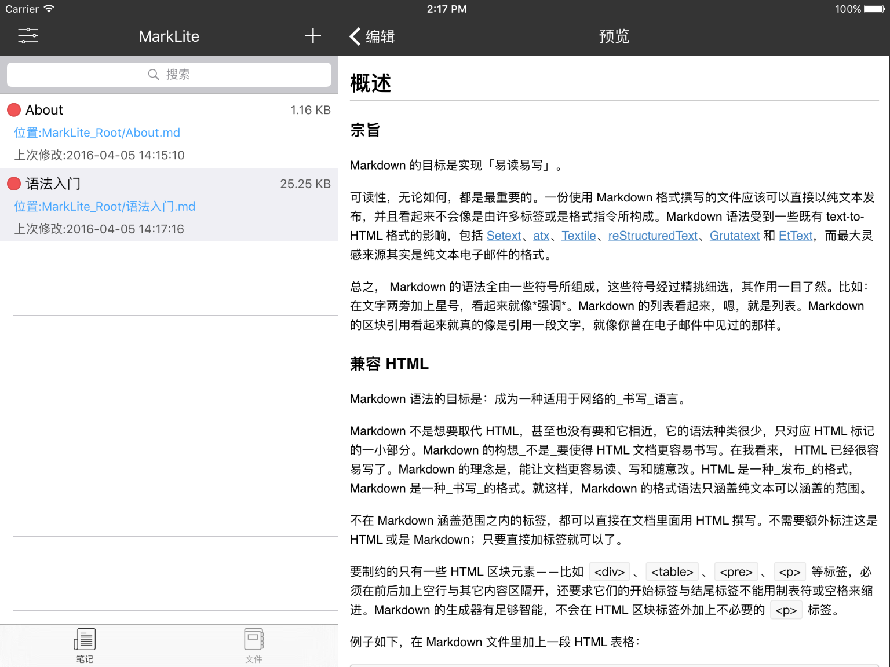

## MarkLite

### 简介

**MarkLite** 是一个免费且好用的Markdown文本编辑器，遵行 `MIT` 协议。

可以在iPhone/iPad等iOS设备上运行，让你随时随地进行流畅的书写和阅读。MarkLite支持标准的Markdown语法之外，也支持一些常用的扩展语法，比如`数学表达式`、`Footnote`、`TodoList`等。在保持功能完整的前提下，界面尽可能地做到了简洁，不会有一些花哨但没卵用的功能。

>iPad效果图:

>iPhone效果图:

### 功能

* 简洁清晰的语法高亮
* 快速的渲染，支持多种`CSS`
* Airdrop导入导出
* 支持`3d-Touch`
* 支持标准的Markdown语法和扩展语法
* 可以以文件夹的形式对文档分类管理
* 可以导入本地图片
* 键盘工具条辅助输入

### 安装
最低支持iOS7.0。iPhone和iPad均能完美运行。

* 可以从[AppStore]()免费获取
* 也可以从[Github](https://github.com/zhubch/MarkLite)上获取源代码通过Xcode编译并安装到设备上

### 使用

### 联系作者
* email:cheng4741@gmail.com