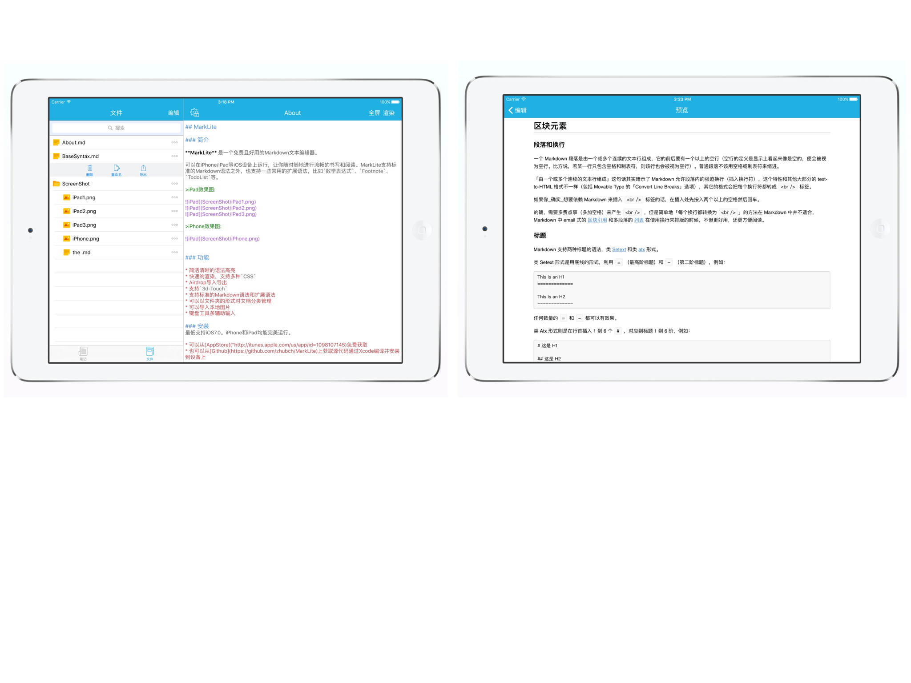
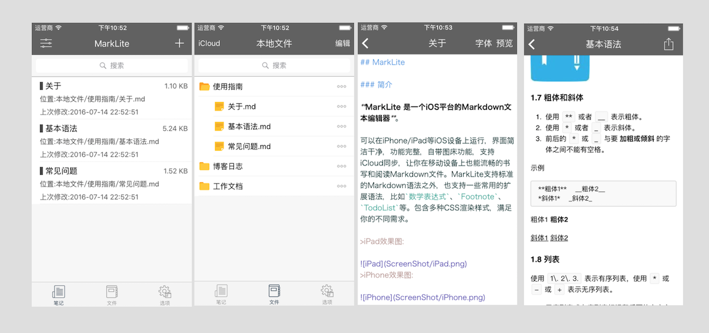

## MarkLite

### 简介

**MarkLite 是一个iOS平台的Markdown文本编辑器**。

可以在iPhone/iPad等iOS设备上运行，界面简洁干净，功能完整，自带图床功能，支持iCloud同步，让你在移动设备上也能流畅的书写和阅读Markdown文件。MarkLite支持标准的Markdown语法之外，也支持一些常用的扩展语法，比如`数学表达式`、`Footnote`、`TodoList`等。包含多种CSS渲染样式，满足你的不同需求。

**AppStore:**[https://appsto.re/cn/jK8Cbb.i](https://appsto.re/cn/jK8Cbb.i)

有任何Bug或者改进意见欢迎提issue

>iPad效果图:

>iPhone效果图:

### 功能

* 支持从其他app打开md文件
* 支持iCloud存储，可以在不同设备上共享文件
* 支持导出多种格式，PDF，Web页面
* 一键导入本地图片并上传到图床
* 快速的渲染，支持多种`CSS`
* 支持Airdrop导入导出
* 支持标准的`Markdown`语法和扩展语法
* 支持创建文件夹的形式对文档分类管理
* 键盘工具条辅助输入

### 联系作者
##### Email:[cheng4741@gmail.com](cheng4741@gmail.com)

### 开源协议

欢迎在此基础上写出更牛逼的App。**但请不要换个图标，改个名字就变成自己的应用拿去上线**

本项目使用`SATA`协议(The Star And Thank Author License)，反正我不管，你在使用前要先star😈。详见[LICENSE](LICENSE.txt)文件。