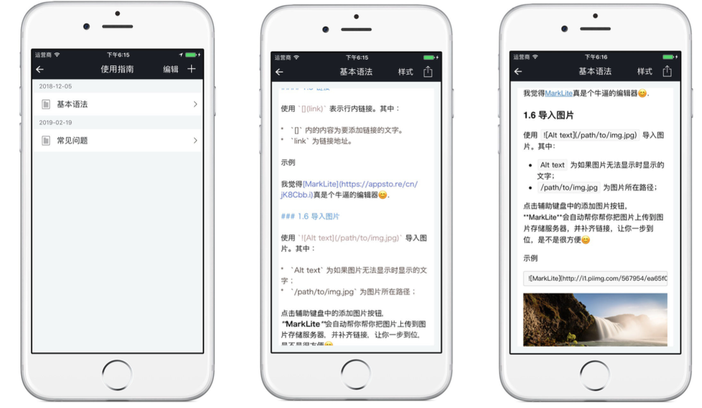

## MarkLite

### 简介

MarkLite 是极简风格的markdown编辑器，界面主色调只有简单的黑白两色，大小只有1.5M左右，功能上一直保持够用而不冗余。如果你像我一样是个极简主义者，一定不会想要错过它。

目前支持的语言有英语、简体中文、繁体。

有任何Bug或者改进意见欢迎提issue

>iPad效果图:

>iPhone效果图:

### 功能

* 支持从其他app打开md文件
* 图片本地引用
* 代码块内部高亮，有多种样式
* 支持iCloud存储，可以在不同设备上共享文件
* 可以导出多种格式，PDF，Web页面等
* 一键插入图片并上传到图床
* 快速的渲染，支持多种`CSS`
* 支持Airdrop导入导出
* 标准的`Markdown`语法和扩展语法
* 键盘工具条辅助输入

### 联系作者
##### Email:[cheng4741@gmail.com](mailto:cheng4741@gmail.com)

### 开源协议

如果本App或者源代码能对你有所帮助，我会很开心，也欢迎在此基础上写出更好用的作品。同时也希望大家能尊重他人劳动成果，不要简单换个图标，改个名字就变成了自己的应用。

本项目使用`SATA`协议(The Star And Thank Author License)😈。详见[LICENSE](LICENSE.txt)文件。